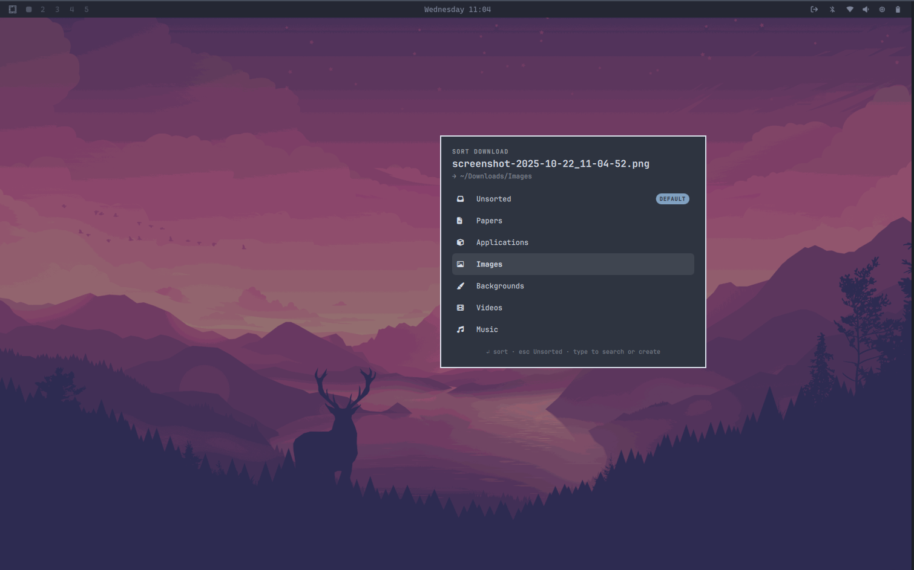

# Downlodarchy

A download organizer plugin for [Omarchy](https://omarchy.org). Every new file
that lands in `~/Downloads` pops up a small floating box asking which category
folder it belongs in — Papers, Applications, Images, Backgrounds, and so on.
Dismiss it (or just wait) and the file goes to your default category. No more
messy Downloads folder.

This is a simple download manager that helps users organize their downloaded
files into categories that can be accessed and edited later.



## Features

- **Category box on every download** — themed floating card with keyboard
  navigation: `↑`/`↓` to choose, `Enter` to sort, type-to-filter, and an
  inline "Create" row for brand-new categories.
- **Default category** — `Esc`, clicking outside, or 20 seconds of inactivity
  files the download into the default category (`Unsorted` out of the box;
  change it from the bar widget by clicking the star next to any category).
- **Bar widget** — a download icon in the bar opens a menu of your categories:
  click one to open that folder, star it to make it the default. Also offers
  "Sort leftovers" to sweep stray files still sitting in the Downloads root,
  and "Open" for the root folder.
- **Auto-created folders** — categories map to subdirectories under
  `~/Downloads`; missing directories are created on first use and name
  collisions are resolved as `report (1).pdf`.
- **Browser-friendly** — only watches completed files (`close_write` /
  `moved_to`), ignoring `.part`, `.crdownload`, and other temp files.

## Installation

```bash
omarchy plugin add https://github.com/mohpydev/Downlodarchy.git --enable
```

The plugin registers a bar widget; Omarchy asks where to place it during
enable (right section recommended). The service starts watching
`~/Downloads` immediately.

### Removal

```bash
omarchy plugin remove mohpydev.downlodarchy --yes
```

Your category folders under `~/Downloads` and settings in
`~/.config/downlodarchy/config.json` are left untouched; delete them manually
if you want a fully clean slate.

## Usage

| Action | How |
|--------|-----|
| Sort a download | Pick a category in the box, or type to search/create one |
| Accept default | `Enter` (default is pre-highlighted) or just wait ~20s |
| Change default category | Bar icon → star next to a category |
| Open a category folder | Bar icon → click the category |
| Sort existing strays | Bar icon → "Sort leftovers", or `omarchy-shell mohpydev.downlodarchy organize` |
| Sort a specific file | `omarchy-shell mohpydev.downlodarchy pick /path/to/file` |
| Inspect current config | `omarchy-shell mohpydev.downlodarchy status` |

Categories live in `~/.config/downlodarchy/config.json`:

```json
{
  "version": 1,
  "defaultCategory": "Unsorted",
  "categories": [
    { "name": "Unsorted", "icon": "" },
    { "name": "Papers",   "icon": "" }
  ]
}
```

`icon` is any nerd-font glyph. Edits hot-reload; new categories can also be
created directly inside the sort box.

## Dependencies

- Omarchy (Quickshell-based shell) — this is an Omarchy shell plugin
- `inotify-tools` (`inotifywait`) — preinstalled on Omarchy
- `xdg-open` (from `xdg-utils`) — preinstalled on Omarchy

## Development

The repo root *is* the plugin: `manifest.json` plus QML/JS/shell sources.
Validate after changes with:

```bash
omarchy plugin validate .
```

If you cloned this repo directly into `~/.config/omarchy/plugins/`,
saving any file hot-reloads the running shell.

## License

MIT — see [LICENSE](LICENSE).
